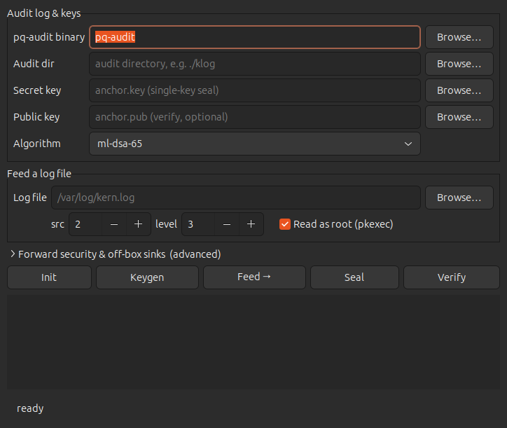

<div align="center">

<a href="https://github.com/effjy/pq-audit/"></a>

**Tamper-evident, post-quantum audit logging for Linux — the record you can prove.**

[](LICENSE)
[](#)
[](#)
[](#)
[](#)
[](#)
[](#)
[](https://github.com/open-quantum-safe/liboqs)

An append-only, hash-chained log of security events whose integrity is sealed
with NIST's post-quantum signature standards. Any later edit, reorder, deletion,
or truncation is detected on `verify` — and a quantum adversary still can't forge
the seals over archived evidence.

[Why](#-why) · [How it works](#-how-it-works) · [Install](#-install) · [Quick start](#-quick-start) · [Desktop GUI](#-desktop-gui) · [Feeding](#-feeding-pq-audit) · [Sealing](#-sealing-m2) · [Forward security](#-forward-security-m3) · [Proofs](#-merkle-inclusion-proofs-m4) · [Off-box sinks](#-off-box-seal-sinks) · [Daemon](#-ingest-daemon-m5) · [Rotation](#-segment-rotation) · [Security](#-security-notes)

</div>

---

## 💡 Why

When a system is compromised, the logs that record the intrusion are the first
thing an attacker edits — rewriting lines, fixing timestamps, deleting the
entries that incriminate them. Classical signing (GPG, or journald's HMAC-based
Forward Secure Sealing) is also quantum-exposed for evidence that must stay
trustworthy for years.

`pq-audit` makes the record **tamper-evident** and **quantum-resistant**:

- 🔗 **Hash chain** — every entry commits to the previous one, so any edit,
  reorder, or gap is detected at the exact sequence number.
- 🛡️ **Post-quantum seals** — the chain head + a Merkle root are signed with
  **ML-DSA** (FIPS 204) or **SLH-DSA** (FIPS 205); a wholesale rewrite can't
  produce a valid seal without the secret key.
- ⏳ **Forward security** — per-epoch keys are destroyed after use, so capturing
  the box can't forge *past* entries.
- 🧾 **Merkle proofs** — prove a single entry is in the sealed log without
  shipping the whole log.
- 📡 **Off-box anchoring** — mirror seals to append-only sinks an attacker can't
  reach retroactively.
- 🛰️ **Ingest daemon** — accept events over a unix socket, auto-seal on a
  schedule, rotate segments, seal once more on shutdown.

It builds on a vendored copy of [`pq-sign`](https://github.com/effjy/pq-sign)
for the PQ primitives — no new cryptography is invented, only composed.

---

## 🧩 How it works

```
   producers              pq-audit                        verifier (offline)
 ┌──────────┐  NDJSON   ┌────────────────────┐  segments  ┌──────────────────┐
 │ tids     ├──────────▶│  append → hash chain│            │ verify chain     │
 │ syslog   │  (socket) │        │            │  *.palog   │   ↳ recompute    │
 │ auditd   ├──────────▶│   periodic SEAL     ├───────────▶│ verify seals     │
 │ apps     │           │   (ML-DSA/SLH-DSA)  │  *.seal    │   ↳ ML-DSA/SLH-DSA│
 └──────────┘           │   epoch key evolve  │            │ verify proofs    │
                        │   off-box sinks     │   sinks    │   ↳ Merkle path  │
                        └────────────────────┘──────────▶ └──────────────────┘
```

Each entry's hash is
`SHA-256("pq-audit/entry/v1" ‖ prev_hash ‖ seq ‖ timestamps ‖ src ‖ level ‖ payload)`,
the first entry is seeded from the segment header, and segments are linked
across rotation via `prev_segment_root`. A **seal** signs
`SHA-256(… ‖ chain_head ‖ merkle_root)`, so the signature anchors both the chain
and the Merkle tree. Exit codes mirror pq-sign: **`0`** ok, **`2`**
tamper/invalid, **`1`** usage/IO.

---

## 📦 Install

Needs a C11 compiler, **OpenSSL ≥ 3.0**, **libargon2**, and **liboqs** (for the
PQ seals).

```sh
# Debian / Ubuntu
sudo apt install build-essential pkg-config libssl-dev libargon2-dev
# …then build liboqs (rarely packaged) — the vendored pq-sign ships a helper:
#   see vendor/pqsign and https://github.com/open-quantum-safe/liboqs

make            # builds ./pq-audit
make check      # full test suite (chain, seals, FS, proofs, daemon, rotation)
make asan       # the same suite under ASan/UBSan   (LSAN=0 inside containers)

sudo make install     # installs pq-audit → /usr/local/bin
sudo make uninstall   # removes it
```

> `vendor/pqsign/` is an unmodified copy of pq-sign's library sources plus a
> small `pqoqs.c` liboqs glue layer; pq-audit is otherwise self-contained.

### Desktop GUI (optional)

The [desktop GUI](#-desktop-gui) additionally needs **GTK 3** (`libgtk-3-dev`)
and, for reading root-only logs, **polkit** (`pkexec`):

```sh
sudo apt install libgtk-3-dev policykit-1
cd gui
make                  # builds ./gui/pq-audit-gui
sudo make install     # installs the binary, icon, and .desktop entry
sudo make uninstall   # removes them
```

`make install` puts `pq-audit-gui` on your PATH and registers the application
icon + menu entry, so it appears in your launcher and taskbar. Install the
[CLI](#-install) too (above) — the GUI shells out to `pq-audit`, which must be
on your PATH. Override the location for either with `PREFIX=` / `DESTDIR=`.

---

## 🚀 Quick start

```console
$ pq-audit init --dir ./log
initialized audit segment in ./log

$ echo '{"t":"tids.alert","profile":"slow-exfil"}' | pq-audit log --dir ./log --src 1 --level 4
entry 0 sealed into chain
  head: 20ae71e1…

$ echo "ssh login root from 10.0.0.9" | pq-audit log --dir ./log --src 2 --level 3
entry 1 sealed into chain
  head: 984da6dc…

$ pq-audit verify --dir ./log
VERIFY OK: 2 entries
  head: 984da6dc…

# any in-place edit breaks the chain at the exact entry:
$ pq-audit verify --dir ./log
VERIFY FAILED: chain broken at seq 1
$ echo $?
2
```

`--src` tags the producer (e.g. tids=1, syslog=2, app=3); `--level` is severity.

---

## 🖥️ Desktop GUI

The CLI is precise but ceremonious. `gui/` ships a small **GTK3** front-end that
drives the same binary — pick a log file, click **Feed → Seal → Verify**, and
read the result in a live console. It is a thin wrapper: it never links the
pq-audit core, it just shells out to `pq-audit` and streams stdout/stderr, so
it tracks the CLI automatically and adds no cryptographic surface of its own.

<div align="center">
  
</div>
<br><br>

```sh
cd gui && make            # needs gtk+-3.0 (pkg-config)
sudo make install         # optional: PATH + menu/taskbar entry (see Install)

pq-audit-gui              # if installed; else ./pq-audit-gui from the build dir
```

The binary field defaults to `pq-audit` (found on your PATH once the
[CLI is installed](#-install)); point it elsewhere if you keep it in a build
dir.

What the window gives you:

- **Audit log & keys** — binary path, audit dir, secret/public key, and an
  **algorithm dropdown** (`ml-dsa-44/65/87`, `slh-dsa-128f/192f/256f`) used by
  **Keygen**. Keygen auto-fills the key/pub fields.
- **Feed a log file** — file picker, `src`/`level` spinners, and a **“Read as
  root (pkexec)”** toggle (on by default). The entire ingest loop runs inside a
  *single* `pkexec sh -c …`, so reading a root-only file like
  `/var/log/kern.log` costs **one** password prompt, not one per line.
- **Forward security & off-box sinks** — **FS-Init** (epochs + anchor algorithm)
  and **FS-Advance** for the forward-secure keyring; a **sink** field mirrors
  seals off-box (`--sink`) and a **seal-file** field verifies against a trusted
  copy (`--seal-file`).
- **Init / Keygen / Feed → / Seal / Verify** buttons, plus a console that echoes
  each command and decodes pq-audit's exit codes (`0` OK, `2` tamper/invalid).

Seal prefers the forward-secure **keyring** (`--ring`) when its field is set and
falls back to the single **key** (`--key`) otherwise; Verify uses
`--fspub`/`--anchor` when both are set, else `--pub`. So the same window covers
the basic, forward-secure, and off-box workflows below.

> The GUI runs as your normal user — only the privileged *reads* are elevated
> via polkit, so the GTK toolkit never runs as root.

---

## 🔌 Feeding pq-audit

pq-audit is **standalone** — it depends on no other tool. An entry's payload is
just opaque bytes, so anything that produces text can feed it. The `--src`
number is a label you choose to record *where* an entry came from; it implies no
particular producer.

```sh
# a single line / command output
echo "ssh login root from 10.0.0.9"          | pq-audit log --dir ./log --src 2
date; uptime                                  | pq-audit log --dir ./log

# arbitrary structured events
echo '{"event":"usb_inserted","dev":"sdb"}'   | pq-audit log --dir ./log --src 3

# follow an existing log into the chain
journalctl -f | while IFS= read -r line; do
    printf '%s' "$line" | pq-audit log --dir ./log --src 2
done

# or stream straight into the ingest daemon's socket (one entry per line)
tail -F /var/log/auth.log | socat - UNIX-CONNECT:/run/pq-audit.sock
```

> The docs use `tids` as a running example of a producer (per the project's
> origin), but that is narrative only — pq-audit links against nothing external
> and works with any source, or none.

---

## 🔏 Sealing (M2)

The chain alone makes tampering *inconsistent*, but a root attacker could
rewrite the whole file from byte zero. Sealing closes that: it signs the chain
head with a post-quantum key.

```console
$ pq-audit keygen --out anchor --alg ml-dsa-65        # once; add --encrypt to protect at rest
Generated ml-dsa-65 keypair
  public: anchor.pub
  secret: anchor.key

$ pq-audit seal --dir ./log --key anchor.key
sealed audit.seal through seq 1
  alg:   ML-DSA-65  (key_epoch 0)
  head:  984da6dc…
  merkle:c4d842c6…

$ pq-audit verify --dir ./log --pub anchor.pub
VERIFY OK: 2 entries
SEALS OK: 1 seal(s), signed through seq 1
```

Algorithms (whatever your liboqs build enables): `ml-dsa-44/65/87` (lattice,
fast/compact) and `slh-dsa-128f/192f/256f` (hash-based, conservative).

---

## ⏳ Forward security (M3)

A single sealing key is a single point of failure. `fs-init` pre-generates *N*
independent epoch keys plus one long-term **SLH-DSA anchor** that signs a
manifest of all epoch public keys. `seal --ring` signs with the current epoch;
`fs-advance` **destroys** that epoch's secret. Capture the box at epoch *e* and
seals from epochs `< e` still can't be forged.

```console
$ pq-audit fs-init --out fs --alg ml-dsa-65 --anchor slh-dsa-128f --epochs 30
Forward-secure keyring initialized
  epochs:  30 × ML-DSA-65
  anchor:  SPHINCS+-SHA2-128f-simple
  ring:    fs.fsring  (secret — keep off the monitored box)
  bundle:  fs.fspub + fs.anchor.pub  (verifier)

$ pq-audit seal --dir ./log --ring fs.fsring        # signs with current epoch
$ pq-audit fs-advance --ring fs.fsring              # destroy that epoch's secret
destroyed epoch 0 secret; next seal uses epoch 1

$ pq-audit verify --dir ./log --fspub fs.fspub --anchor fs.anchor.pub
SEALS OK: 1 seal(s), signed through seq 1 (forward-secure)
```

The verifier authenticates the epoch keys against the anchor first, then each
seal against its epoch's key. Ship only `fs.fspub` + `fs.anchor.pub` to verifiers.

---

## 🧾 Merkle inclusion proofs (M4)

Every seal commits to a Merkle root over the entries it covers, so you can prove
one entry is in the sealed log without shipping the whole thing.

```console
$ pq-audit proof --dir ./log --seq 4711 > entry.proof
$ pq-audit check-proof --root <merkle-root-from-a-verified-seal> < entry.proof
PROOF OK: entry 4711 is in the sealed log
```

A wrong root or a tampered proof exits `2`.

---

## 📡 Off-box seal sinks

A root attacker can still *delete* the local `audit.seal` to erase evidence.
`--sink` mirrors every seal to append-only file(s) — a separate mount, a WORM
volume, a remote-synced dir. A sink is byte-identical to `audit.seal`, so you
verify against the trusted copy with `--seal-file`:

```console
$ pq-audit seal --dir ./log --key anchor.key --sink /mnt/worm/audit.seal
# …attacker deletes ./log/audit.seal …
$ pq-audit verify --dir ./log --pub anchor.pub --seal-file /mnt/worm/audit.seal
SEALS OK: 1 seal(s), signed through seq 1 [off-box sink]
```

---

## 🛰️ Ingest daemon (M5)

`run` listens on a unix socket, treats each newline-delimited line as one entry,
auto-seals on a count and/or time schedule, rotates segments, and seals once
more on SIGINT/SIGTERM. The signing key is unlocked once at start-up,
**non-interactively** — passphrase from `--passphrase-fd` or `PQA_PASSPHRASE`.

```sh
pq-audit run --dir ./log --ingest unix:/run/pq-audit.sock \
             --key anchor.key --seal-every 1000 --seal-interval 60 \
             --max-entries 100000 --sink /mnt/worm/audit.seal --src 1
```

A producer just writes lines to the socket:

```sh
printf '{"t":"tids.alert"}\n' | socat - UNIX-CONNECT:/run/pq-audit.sock
```

---

## 🔄 Segment rotation

Logs roll into `audit-000000.palog`, `audit-000001.palog`, … Each new segment's
header carries the previous segment's final head (`prev_segment_root`), so the
chain — and `verify`, `proof`, sealing — span segments seamlessly. The daemon
rotates automatically at `--max-entries`; you can also do it by hand:

```console
$ pq-audit rotate --dir ./log
rotated to segment 1
$ pq-audit verify --dir ./log          # walks every segment, checks the links
VERIFY OK: 100002 entries
```

A broken link between segments is detected as tamper (exit `2`).

---

## 🔒 Security notes

**Defends against** post-hoc editing/reordering/deletion of entries written
before compromise (even with root + the running key, under forward security),
tail truncation, cross-segment splicing, and a quantum adversary forging seals
over archived evidence.

**Load-bearing assumption.** Seals must reach somewhere the attacker can't
rewrite retroactively — an off-box `--sink`, a WORM mount, or a printed/QR root.
Forward security narrows a live compromise to "only entries after the breach."

**Limits — read before trusting this with anything that matters.**

- 🧪 Built on **liboqs**, which is research-grade and not independently audited;
  FIPS 204/205 themselves are young. Treat the stack as not-yet-production.
- File integrity is bounded by **SHA-256** collision resistance (a deliberate
  trade for streaming large payloads).
- It does **not** establish *who* a key belongs to (no PKI / web of trust), nor
  provide confidentiality — payloads are stored as-is (encrypt them upstream if
  sensitive).
- An attacker present *before* entries exist, with the live key and no off-box
  anchoring, can still forge going forward; forward security and sinks are what
  bound this.

---

## 🗂️ Project layout

```
pq-audit/
├── include/pqaudit.h     public declarations
├── src/
│   ├── main.c            CLI dispatch
│   ├── segment.c         segment format, hash chain, rotation
│   ├── seal.c            PQ sealing + verification, non-interactive key unlock
│   ├── fs.c              forward-secure keyring + anchor manifest
│   ├── merkle.c          Merkle tree + inclusion proofs
│   ├── daemon.c          `run` ingest daemon (poll loop)
│   └── util.c            SHA-256, time, atomic writes
├── vendor/pqsign/        vendored pq-sign library + liboqs glue (pqoqs.c)
├── gui/                   GTK3 front-end (shells out to the binary)
│   ├── pq-audit-gui.c     single-file app: pickers, pkexec feed, live console
│   └── Makefile           gtk+-3.0 build
├── tests/run.sh          end-to-end suite
└── Makefile
```

---

## 🧪 Testing

```sh
make check    # 31 end-to-end checks across every milestone
make asan     # the same under AddressSanitizer + UBSan (set LSAN=0 in containers)
```

The suite covers chain tamper/truncation, signer binding, wholesale-rewrite
rejection, forward-secure seal/advance/anchor, Merkle proofs, off-box sinks, the
ingest daemon (socket + auto/shutdown seals), and cross-segment rotation.

---

## 📜 License

MIT © 2026 Jean-Francois Lachance-Caumartin
